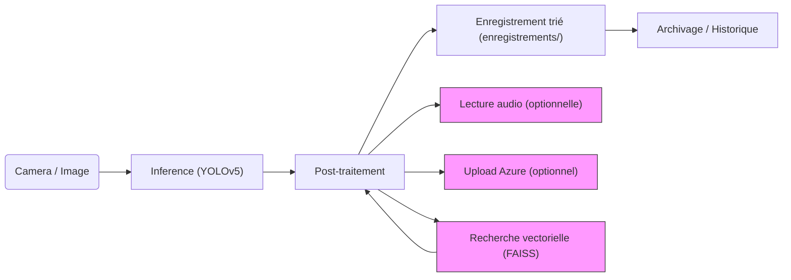
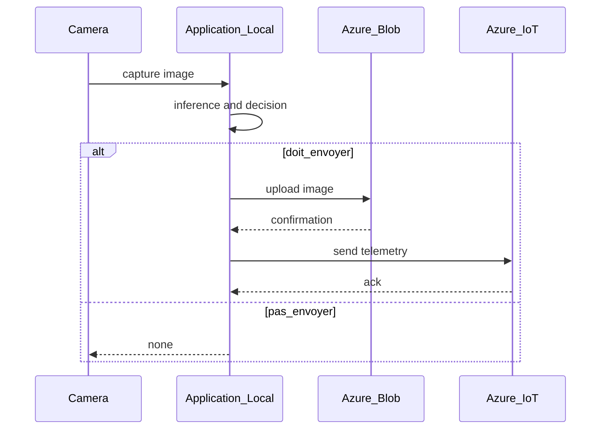

 # Principes expliqués : IA, classification et détection vectorielle

Ce document donne une explication claire et pédagogique des principes qui sous-tendent le système : comment fonctionne une IA de reconnaissance d'images, ce que sont les "embeddings" (vecteurs visuels) et comment on les utilise pour rechercher des images semblables.

## 1) Apprendre à reconnaître : entraînement vs utilisation

- Entraînement : on montre à l'ordinateur beaucoup d'exemples (photos étiquetées) et on le laisse ajuster des paramètres internes pour réduire ses erreurs. C'est la phase longue et coûteuse, réalisée une seule fois.
- Inférence (ou utilisation) : une fois entraîné, le modèle peut rapidement analyser une nouvelle image et proposer une prédiction. C'est ce qui se passe dans `analyse_oiseaux.py` quand on lui donne une photo.

Analogie : l'entraînement, c'est comme apprendre à un ornithologue en lui montrant des albums photo ; l'inférence, c'est l'ornithologue qui donne son avis quand on lui montre une nouvelle photo.

## 2) Comment une IA donne une prédiction (concept simplifié)

- Le modèle regarde l'image et calcule des nombres internes qui résument formes, couleurs, textures.
- À la fin, il produit un score pour chaque espèce possible (par ex. héron : 0.85, cormoran : 0.10, autre : 0.05).
- Le score le plus élevé devient la prédiction (top‑1). La "confiance" exprimée est ce score.

Important : ce score n'est pas une certitude absolue, mais une indication statistique basée sur ce que le modèle a appris.

## 3) Pourquoi on a besoin de seuils (BDD / INCERTITUDE / HORS_BDD)

- Un seuil élevé (ex. 0.60) signifie qu'on demande au modèle d'être assez sûr avant d'« accepter » la détection.
- Entre deux seuils, on marque l'image comme "douteuse" (INCERTITUDE) pour revue humaine.
- En dessous d'un seuil bas, on considère que l'image est probablement hors de la base de connaissances (HORS_BDD).

Ces règles permettent d'automatiser la gestion et d'éviter des faux positifs trop nombreux.

## 4) Embeddings et recherche par similarité (principe)

- Embedding : on convertit une image en une liste de nombres (un vecteur). Ce vecteur capture l'apparence globale de l'image.
- Normalisation : on met ces vecteurs sur la même échelle (important pour comparer correctement).
- Mesure de similarité : on compare deux vecteurs avec une opération mathématique (produit scalaire / cosinus). Plus le résultat est proche de 1, plus les images sont similaires.

Analogie : imagine des fiches où chaque fiche a des cases remplies (couleurs dominantes, formes...). Deux fiches proches signifient photos proches.

## 5) CLIP + FAISS : rôle de chacun

- CLIP : un modèle qui sait produire des embeddings visuels robustes (et aussi relier images et texte). On l'utilise pour transformer image → vecteur.
- FAISS : une bibliothèque optimisée pour retrouver rapidement les vecteurs les plus proches dans une grande base (index). Sans FAISS, la recherche serait trop lente sur des milliers d'images.

Workflow résumé : construire l'index (une opération hors ligne), puis pour chaque nouvelle image : calculer son vecteur (CLIP) et interroger FAISS pour obtenir les voisins les plus proches.

## 6) Pourquoi normaliser et utiliser produit intérieur (inner product)

- Si on normalise les vecteurs (longueur = 1), le produit intérieur devient équivalent au cosinus d'angle, une mesure de similarité usuelle et efficace.
- FAISS peut utiliser ce produit intérieur pour rendre les recherches rapides et précises.

## 7) Comment combiner classification et similarité (idée pratique)

- Règle simple : si le classifieur est incertain (score faible) mais le voisin le plus proche a une similarité élevée, on peut considérer la prédiction comme "probable" et la passer en revue prioritairement.
- Cette combinaison n'est pas magique : elle améliore certains cas (ré-utilisation d'exemples) mais peut aussi renforcer des biais si la base contient des erreurs.

## 8) Limitations et précautions

- Domaine : un modèle entraîné sur un certain type de photos peut mal se comporter sur des images très différentes (luminosité, angle, espèces non présentes).
- Biais : si les exemples d'entraînement sont déséquilibrés, les résultats seront biaisés.
- Similarité visuelle ne remplace pas l'étiquette : deux images peuvent se ressembler sans représenter la même espèce (contexte, posture).

## 9) Points pratiques à retenir

- L'entraînement est séparé de l'utilisation. L'utilisateur ne « réentraîne » pas lors d'une capture.
- L'inférence est rapide, mais la rapidité dépend du matériel (GPU accélère beaucoup).
- FAISS rend la recherche visuelle scalable (utile si vous avez des milliers d'images).

---

Si tu veux, je peux transformer cette explication en une infographie simple (3 blocs : caméra → IA → recherche vectorielle) ou écrire une version très courte pour un public non spécialiste (1 page).

# Guide d'architecture — entraînement, tests, sons, index vectoriel

Ce document décrit une architecture recommandée pour organiser le projet : entraînement, jeux de données, tests, gestion des fichiers audio, index vectoriel et intégration continue. Il vise la clarté, la reproductibilité et la maintenance.

## 1. Arborescence recommandée

- `yolov5/` : code source principal (déjà présent).
- `data/` : définitions de datasets (`*.yaml`) et scripts d'import.
- `dataset_oiseaux/` : images brutes organisées en `train/`, `val/`, `test/`.
- `enregistrements/` : sorties d'analyse triées par statut (`BDD/`, `INCERTITUDE/`, `HORS_BDD/`).
- `vectors/` : index FAISS et `mapping.json` (ex: `index.faiss`, `mapping.json`).
- `cri_predateur_ou_detresse/` : assets audio (sous-dossiers par espèce, fichiers `.mp3`).
- `runs/` : expériences d'entraînement et sorties (checkpoints, logs).
- `tests/` : tests unitaires et d'intégration exécutables par CI.
- `scripts/` : outils utilitaires (construction d'index, validation de dataset, export).

## 2. Séparation des responsabilités

- Code d'inférence (runtime) : tout ce qui est utilisé pour l'analyse en production (ex. `analyse_oiseaux.py`, `classify/predict.py`). Doit rester léger et robuste face aux dépendances optionnelles (CLIP/FAISS). Charger CLIP/FAISS uniquement si `vectors/index.faiss` existe.
- Code d'entraînement : scripts et configs (`train.py`, fichiers YAML de modèle). Ils peuvent utiliser plus de dépendances (GPU, apex, etc.).
- Outils hors ligne : indexation, prétraitement, augmentation, calibration des seuils — placés dans `scripts/`.

## 3. Entraînement — bonnes pratiques

- Environnements : utiliser un environnement isolé (`.venv` ou `conda`) et un `requirements.txt` ou `pyproject.toml` pin‑né.
- Reproductibilité : fixer seeds (numpy, torch, random), enregistrer la config d'entraînement (`args`/`yaml`) et l'`hash` des sources.
- Checkpoints & artefacts :
  - Sauvegarder checkpoints périodiquement dans `runs/train/<exp>/weights/`.
  - Conserver un `best.pt` et les fichiers de logs (tensorboard, csv).
- Expériences : pour chaque expérience, conserver un fichier `meta.json` décrivant dataset, hyperparams, commit git, date.

## 4. Tests & validation

- Types de tests :
  - Unitaires : fonctions de prétraitement, parsing, utils — rapides et isolés.
  - Intégration légère : exécuter un pipeline d'inférence sur 5 images de test pour vérifier end‑to‑end.
  - Smoke tests GPU/CPU : s'assurer que l'inférence ne crash pas sur GPU/CPU.
- Emplacement : `tests/` avec `pytest`.
- CI : lancer les tests unitaires à chaque PR; lancer integration smoke tests périodiquement (ou sur demande).

## 5. Gestion des sons (assets audio)

- Structure : `cri_predateur_ou_detresse/<Espece>/<fichiers>.mp3`.
- Métadonnées : ajouter un `metadata.csv` (espece, fichier, durée, licence, origine) pour faciliter audits et réutilisation.
- Licence & provenance : stocker licence et source dans `metadata.csv` pour éviter problèmes légaux.
- Usage runtime : lecture via `play_audio()` avec gestion d'erreurs et fallback — ne pas lancer de sons en mode batch.

## 6. Index vectoriel (CLIP + FAISS)

- Construction hors‑ligne : script `scripts/build_vector_index.py` qui :
  1. parcourt un dossier source d'images,
  2. calcule embeddings CLIP (ou équivalent),
  3. normalise les vecteurs,
  4. construit un index FAISS et écrit `mapping.json`.
- Emplacement de l'index : `vectors/index.faiss` + `vectors/mapping.json`.
- Chargement runtime : l'inférence doit tester l'existence de `vectors/index.faiss` avant d'importer CLIP/FAISS.
- Calibration : fournir un script `scripts/calibrate_similarity.py` qui calcule distributions intra/inter‑classe pour choisir un seuil `VECTOR_SIMILARITY_THRESH`.

## 7. Décision automatique & règles métier

- Exemple simple :
  - `score >= BDD_THRESHOLD` → statut `BDD`
  - `INCERTITUDE_LOW <= score < BDD_THRESHOLD` → `INCERTITUDE`
  - `score < INCERTITUDE_LOW` → `HORS_BDD`
- Règle optionnelle avec vecteurs : si `score` est faible mais `nearest_similarity >= VECTOR_SIMILARITY_THRESH` → marque comme `probable BDD` (à revoir manuellement).

## 8. Observabilité & logs

- Logs structurés (JSON) pour les événements importants : prediction, action de sauvegarde, erreur de lecture audio, résultat du match vectoriel.
- Metrics : erreurs par catégorie, latences d'inférence, taille de l'index.

## 9. CI/CD & recettes d'exécution

- CI minimal :
  - `pytest` pour tests unitaires.
  - Lint (flake8/ruff) + format (black/isort) en pré‑commit.
- Jobs optionnels : build et test de l'index en image séparée si nécessaire.

Exemples de commandes rapides

```bash
# exécuter tests
python -m pytest -q

# construire l'index (exemple)
python scripts/build_vector_index.py --sources dataset_oiseaux/train --out vectors

# lancer l'analyse caméra
python analyse_oiseaux.py --camera
```

## 10. Checklist avant mise en production

- Valider dataset et licences audio.
- Vérifier que l'index `vectors/index.faiss` est construit et accessible.
- Scripter le déploiement ou fournir un dockerfile si requis.
- Documenter comment recalibrer `VECTOR_SIMILARITY_THRESH`.

---

## Schémas

Voici trois schémas Mermaid pour visualiser l'architecture, le flux d'envoi Azure et le flux de recherche vectorielle.

### Architecture générale



### Flux d'envoi vers Azure (Blob + IoT Hub)



### Flux de recherche vectorielle (CLIP + FAISS)


Tu peux prévisualiser ces diagrammes dans VS Code (extension Mermaid) ou sur GitHub si le rendu Mermaid est activé.


Si tu veux, j'ajoute :
- un script `scripts/build_vector_index.py` d'exemple prêt à l'emploi,
- des tests d'intégration d'inférence minimal,
- ou un `README_ARCHITECTURE.md` plus court et imprimable.
